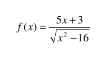
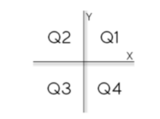

1. Criar um algoritmo que receba o valor de x, e calcule e imprima o valor de f(x). 

2. Chico tem 1,50 metro e cresce 2 centímetros por ano, enquanto Zé tem 1,10 metro e cresce 3 centímetros por ano. Construa um algoritmo que calcule e imprima quantos anos serão necessários para que Zé seja maior que Chico. 

3. Dado três valores, A, B e C, construa um algoritmo para verificar se estes valores podem ser valores dos lados de um triângulo, e se for, se é um triangulo escaleno, um triangulo equilátero ou um triangulo isósceles.

4. Dados três valores A, B e C, construa um algoritmo para verificar se estes valores podem ser valores dos lados de um triângulo, e se for classificá-los (imprimi-los) segundo os ângulos. (Triângulo Retângulo = 90º, Triângulo Obtusângulo > 90º, Triângulo Acutângulo < 90º)

5. Leia os quatro valores correspondentes aos eixos x e y de dois pontos quaisquer no plano, p1(x1, y1) e p2(x2, y2) e calcule a distância entre eles, mostrando 4 casas decimais após a vírgula, segundo a fórmula: 

6. Leia 2 valores com uma casa decimal (x e y), que devem representar as coordenadas de um ponto em um plano. A seguir, determine qual o quadrante ao qual pertence o ponto, ou se está sobre um dos eixos cartesianos ou na origem (x = y = 0). Se o ponto estiver na origem, escreva a mensagem “Origem”. Se o ponto estiver sobre um dos eixos escreva “Eixo X” ou “Eixo Y”, conforme for a situação. 

7. Faça um algoritmo que leia as três notas de 30 alunos de uma turma. Para cada aluno, calcule a média ponderada, como segue: MP = ( n1*2 + n2*4 + n3*3 ) / 10
> Além disso, calcule a média geral da turma. Mostre a média de cada aluno e uma mensagem "Aprovado", caso a média seja maior ou igual a sete, e uma mensagem "Reprovado", caso contrário. Ao final, mostre a média geral.

8. A prefeitura de uma cidade fez uma pesquisa entre seus habitantes, coletando dados sobre o salário e número de filhos. A prefeitura deseja saber:  
- a) média do salário da população;
- b) média do número de filhos;
- c) maior salário;
- d) percentual de pessoas com salário até R$100,00.

> O final da leitura de dados se dará com a entrada de um salário negativo. (Use o comando do - while) .

9. Em uma eleição presidencial existem quatro candidatos. Os votos são informados através de códigos. Os dados utilizados para a contagem dos votos obedecem à seguinte codificação:  
- 1,2,3,4 = voto para os respectivos candidatos;
- 5 = voto nulo;
- 6 = voto em branco;
> Elabore um algoritmo que leia o código do candidato em um voto. Calcule e escreva:
- total de votos para cada candidato;
- total de votos nulos;
- total de votos em branco;
> Como finalizador do conjunto de votos, tem-se o valor 0.

10. Foi feita uma estatística nas 200 principais cidades brasileiras para coletar dados sobre acidentes de trânsito. Foram obtidos os seguintes dados:  
- código da cidade
- estado (RS, SC, PR, SP, RJ, ...)
- número de veículos de passeio (em 1992)
- número de acidentes de trânsito com vítimas (em 1992)
> Deseja-se saber:
- a) qual o maior e o menor índice de acidentes de trânsito e a que cidades pertencem
- b) qual a média de veículos nas cidades brasileiras
- c) qual a média de acidentes com vítimas entre as cidades do Rio Grande do Sul.

